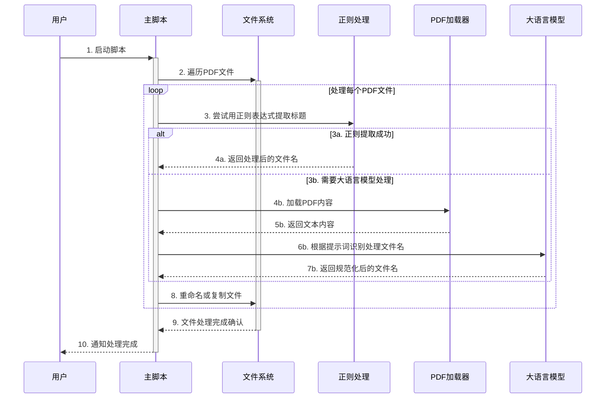

# 大语言模型与RAG实战经验总结：以PDF重命名为例

## 1. 使用场景

从中国知网下载的部分PDF文件中，文件名包含`...`符号，导致无法完整显示论文题目。为了解决这个问题，我开发了一个名为`pdf_rename.py`的脚本，用于自动化处理和重命名PDF文件，特别是学术论文。该脚本的主要应用场景包括：

- 批量处理学术论文（PDF格式）文件名中的不完整或被截断的题目，并自动从原文档中提取准确的文献标题。

在此场景下，使用大语言模型（LLM）和检索增强生成（RAG）的优势在于，LLM可以准确理解和提取PDF内容中的标题信息。这一任务传统的基于规则的方法难以精确完成，因此LLM提供了更智能、灵活的解决方案，能够提升文件名提取和重命名的准确性。

## 2. 总体设计思路

以下是我的的总体设计思路：



## 3. 提示词工程实践

在 `get_paper_title_with_deepseek()` 函数中，可以看到我的提示词工程：

1. **明确角色和任务**：

   ```python
   系统提示：你是一名文件命名助手，需要根据输入的论文文本内容，将标题补充完整。
   ```

2. **详细的规则说明**：

   ```python
   规则：
   - 【只返回】最终的论文标题，【不得包含】其他任何内容。
   - 完整标题与输入标题相似，但可能存在【省略】或【不完整】的情况。
   - 【完整提取】标题，若语义相近的标题跨越多行，说明可能存在【副标题】，请一并提取，
   使用【冒号】分隔主副标题。
   ...
   ```

3. **明确的输出格式**：

   ```python
   输出标题：
   - 以JSON格式输出: ["title": "{part1}{part5}{part3}"]
   ```

4. **提供上下文信息**：

   ```python
   文本内容：
   {text}
   ```

这种结构化的提示词设计有助于LLM理解任务要求，提高输出的准确性和一致性。

## 5. 经验总结

1. 使用JSON格式作为大语言模型的输出具有高可控性和高质量，能够有效提升数据处理的精准性和一致性。
2. 采用检索增强生成（RAG）方法可以显著提升任务的准确率，特别是在需要外部知识验证的场景中表现尤为出色。
3. DeepSeek支持缓存机制，有助于减少重复的API调用，从而在一定程度上降低使用成本。
4. 将大语言模型的自然语言处理优势整合进现有工作流。对于可以通过现有技术（如正则表达式）解决的问题，优先使用现有技术处理，让大语言模型专注于处理其擅长且现有技术无法有效解决的任务，从经济效益的角度最大化利用资源。


